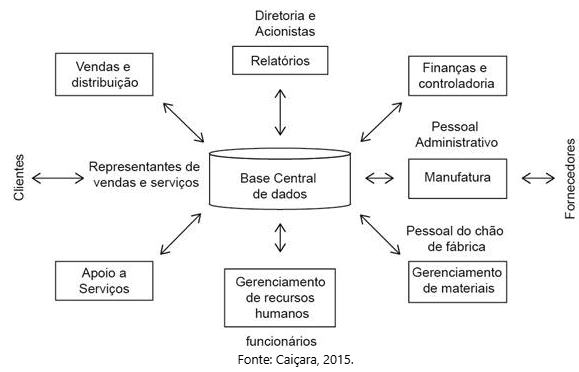

# Teoria dos Sistemas

## O que é:
- Proposta pela primeira vez por Ludwig von Bertalanffy, em 1968.
- Transdisciplinar.
- **Objetivo**: verificar como adaptar o sistema de maneira mais eficaz por meio da orientação por metas e de ciclos de feedback.
- Todos os princípios que compõem um conceito ou ideia podem ser divididos em vários sistemas e subsistemas.
- É "um conjunto estruturado ou ordenado de partes ou elementos que se mantém em interação, isto é, em ação recíproca, na busca da consecução de um ou de vários objetivos", segundo Velosso, onde cada componente exerce influência sobre os demais para atingir o objetivo.
- **Modelo genérico**: entrada -> sistema -> saída.

## Composição de um sistema:
- **Objetivo**: Finalidade para a qual o sistema foi criado.
- **Entradas**: Matéria-prima que inicia o processo de transformação, ou seja, o material, a energia ou os dados que iniciam o processo.
- **Processamento**: Transformação da matéria-prima (entrada) em um produto, serviço ou resultado (saída).
- **Saídas**: Resultados do componente processamento, que devem ser coerentes com o objetivo do sistema.
- **Controles e avaliações**: Verificam se todos os componentes estão coerentes com os objetivos estabelecidos.
- **Retroalimentação/feedback**: Instrumento de controle que visa garantir que a finalidade do sistema seja atingida com sucesso; pode ser considerada uma nova entrada do sistema.

## Finalidade de um Sistema de Informação (SI):
- Principal atribuição é armazenar e processar os dados em informações, segundo Caiçara.
- **Modelo**: dados -> processamento -> informações.

## Elementos de um sistema de informação

## Hardware vs Software
- **Hardware**: Dispositivo físico usado em ou com uma máquina.
- **Software**: Conjunto de códigos instalados no disco rígido de um computador.
- **Comparação**: Hardware é o que você chuta, software é o que você xinga.
- O software se divide em duas grandes classes: software de sistema e software de aplicação. O software de sistema principal é o sistema operacional, que gerencia o hardware, geralmente por meio de uma interface gráfica de usuário (GUI).

## Dado, informação e conhecimento
- **Dados**: "Sinais desprovidos de interpretação ou significado." (Maldon).
- **Informação**: Dados que integram um contexto, tornando-se mais complexos.
- **Conhecimento**: Informação retida com compreensão sobre seu significado.
  - **Conhecimento tácito**: Retido na mente.
  - **Conhecimento explícito**: Codificado e armazenado em diversos meios.
  - **Conhecimento organizacional**: Informação importante para uma organização.

## Sistemas de informação vs Tecnologia da informação
- **Tecnologia da informação**: Subconjunto de sistemas de informação, focando em hardware, software e telecomunicações.
- **Sistemas de informação**: Compreendem pessoas, processos, máquinas e tecnologia da informação, focando na criação e distribuição de informações.

## Classificações de sistemas de informação

- **Critério**: Abrangência departamental.

- **Critério**: Nível funcional.

### Níveis:
- **Operacional**
- **Gerencial**
- **Estratégico**

### Tipos de sistema:
- **Sistema de informação operacional (SPTs)**: Processa transações diárias e auxilia nas operações comerciais.
- **Sistema de informação tático (SIGs)**: Focado em fornecer informações para decisões em níveis gerenciais intermediários.
- **Sistema de planejamento estratégico (SISs)**: Apoia o planejamento de longo prazo e a formulação de estratégias.

## Componentes de um sistema de informação
- **Software**: Programas e procedimentos.
- **Hardware**: Dispositivo de entrada/saída, processador e dispositivos de mídia.
- **Banco de dados**: Dados organizados na estrutura necessária.
- **Rede**: Hubs, meios de comunicação e dispositivos de rede.
- **Pessoas**: Operadores de dispositivos, administradores de rede e especialistas em sistemas.

O processamento da informação inicia-se na *entrada*; após, há o *processo* de dados, o armazenamento de dados, a saída e o controle. Durante o estágio de entrada, as instruções de dados são alimentadas nos sistemas que, durante o estágio de processo, são trabalhados por programas de software e outras consultas. Durante a fase de *saída*, os dados são apresentados em formato estruturado e relatórios.

## Dados Estruturados, Semiestruturados e Não Estruturados
- **Estruturados**: Seguem um modelo de dados predefinido, como em bancos de dados SQL ou arquivos do Excel.
- **Semiestruturados**: Possuem marcadores que ajudam a organizar os dados, como arquivos JSON e XML.
- **Não Estruturados**: Não têm um modelo predefinido, incluindo texto livre, áudio, vídeo e outros formatos.

## Data Warehouse, Data Mart e Data Mining
- **Data Warehouse**: Banco de dados centralizado que armazena dados extraídos de um ou mais bancos de dados da organização.
- **Data Mart**: Subconjunto do data warehouse, criado para atender a necessidades específicas de análise.
- **Data Mining**: Processo de análise de grandes conjuntos de dados para descobrir padrões e tendências ocultas.

## Tipos de Software
- **Pacote de Software**: Conjunto de programas que executam funções específicas.
- **Software-as-a-Service (SaaS)**: Software baseado em nuvem, acessível de qualquer dispositivo com internet.
- **User-friendly**: Software intuitivo e fácil de usar.
- **Open-source**: Software com código-fonte aberto.
- **Freeware**: Software gratuito, mas com algumas restrições.
- **Shareware**: Software disponível para teste, com pagamento necessário para uso contínuo.
- **Licença Proprietária**: Uso restrito do software, com direitos mantidos pelo criador.
- **Groupware**: Software colaborativo que permite compartilhar informações entre grupos.

## Tríade de SI
- **Confidencialidade**
- **Integridade**
- **Disponibilidade**

## Perguntas a serem realizadas pela empresa:
1. Quanto tempo a empresa sobreviverá sem os recursos de informática?
2. Quais ameaças poderão afetar o negócio?
3. O que deverá ser protegido?
4. Quem será afetado se ocorrer um desastre?
5. Qual é a capacidade de recuperação da empresa?
6. Que recursos serão disponibilizados para a segurança da informação?

## Funções básicas de segurança de SI
- **Dissuasão**: Desencorajar a prática de irregularidades.
- **Prevenção**: Reduzir a ocorrência dos riscos.
- **Detecção**: Sinalizar a ocorrência dos riscos.
- **Contenção**: Limitar o impacto do risco.
- **Recuperação**: Alternativa para a continuidade operacional.
- **Restauração**: Corrigir os danos causados pelos riscos.

## Vulnerabilidades de Segurança do Computador
- **Vulnerabilidades de Rede**: Problemas em hardware ou software de redes.
- **Vulnerabilidades do Sistema Operacional**: Falhas que podem ser exploradas para acessar ativos.
- **Vulnerabilidades Humanas**: Erros dos usuários que podem expor dados.
- **Vulnerabilidades do Processo**: Falhas devido à ausência de controles adequados.

## Métodos para Identificar Vulnerabilidades
- **Auditoria de Ativos de Rede**: Mantém um inventário preciso para identificar vulnerabilidades.
- **Teste de Penetração**: Simula ataques para verificar falhas de segurança.
- **Estrutura de Inteligência de Ameaças**: Define o que precisa ser protegido e estabelece metas de segurança.

## Ferramentas para Segurança da Informação
- **Políticas de Segurança**: Diretrizes para o uso dos recursos de informação.
- **Avaliação de Ameaças**: Identificação de riscos para adaptar o plano de segurança.
- **Autenticação**: Verificação da identidade do usuário.
- **Controle de Acesso**: Define quais usuários podem acessar ou modificar informações.

## Medidas de Segurança - Senha e Backup
1. **Segurança da Senha**:
   - **Autenticação de Fator Único**: Insegura, fácil de comprometer.
   - **Políticas de Senha**: Senhas complexas e troca regular.
   - **Treinamento de Funcionários**: Educar sobre não fornecer senhas.
   
2. **Plano de Backup**:
   - **Importância de um Backup Abrangente**: Inclui dados de servidores e computadores individuais.
   - **Backups Regulares**: Frequência baseada na criticidade dos dados.
   - **Armazenamento Externo**: Manter backups em locais separados.
   - **Teste de Restauração de Dados**: Testes regulares para garantir o funcionamento dos backups.

3. **Impacto do Tempo de Inatividade**: Avaliar como uma indisponibilidade prolongada da TI afetaria as operações.

## Gestão e Armazenamento de Dados
- **Política de Retenção de Dados**: Define quais dados devem ser mantidos e o processo de descarte.
- **Ferramentas de Gerenciamento**: Devem incluir recursos como planejamento de capacidade e monitoramento de desempenho.

## Métodos de Gerenciamento:
- Software de gerenciamento de armazenamento.
- Consolidação de sistemas e arrays de armazenamento multiprotocolo.
- Estratégias de armazenamento híbrido e de escala.

## Tipos de Armazenamento:
- **Armazenamento em Bloco**: Para HDDs e SSDs, oferece bom desempenho.
- **Armazenamento de Arquivos**: Simples, organiza arquivos em pastas.
- **Armazenamento de Objetos**: Eficiente para dados não estruturados.

## Redes de Computadores:
- **Pacote**: Unidade fundamental de dados transmitida pela internet.
- **Hub**: Dispositivo que conecta dispositivos em uma rede.
- **Bridge**: Conecta duas redes, permitindo a passagem dos pacotes necessários.
- **Switch**: Conecta múltiplos dispositivos e filtra pacotes.
- **Roteador**: Analisa pacotes e os encaminha para seu destino.
- **Endereço IP**: Identificação única para cada dispositivo na internet.
- **Nome de Domínio**: Nome amigável que substitui o endereço IP.
- **Sistema de Nomes de Domínio (DNS)**: Diretório que traduz nomes de domínio em endereços IP.
- **Comutação de Pacotes**: Método de transmissão de pacotes pela internet.
- **Protocolo**: Conjunto de regras para troca de informações.

## Redes Organizacionais:
- **Redes Locais (LAN)**: Conectam computadores pessoais e periféricos em um prédio ou campus.
- **Redes de Longa Distância (WAN)**: Conectam locais em diferentes cidades ou estados.
- **Computação Cliente-Servidor**: Computadores (clientes) se conectam a servidores para acessar aplicativos.
- **Intranet**: Rede interna acessível apenas dentro da organização.
- **Extranet**: Parte da rede corporativa acessível a clientes e fornecedores.
- **Rede Privada Virtual (VPN)**: Acesso remoto seguro à rede interna.

## Recursos na Nuvem

# Sistemas de Gestão: ERP, SCM, CRM e SGC

## 1. ERP (Enterprise Resource Planning)
**Definição:** Sistema que integra e automatiza processos de negócios, centralizando informações em um banco de dados acessível em tempo real.

**Vantagens:**
- Melhora a visibilidade interdepartamental.
- Reduz conflitos de dados e aumenta a eficiência.
- Facilita a análise de cenários e identificação de melhorias.

**Objetivo:** Unificar pessoas, processos e tecnologia, otimizando operações à medida que a empresa cresce.

## 2. SCM (Supply Chain Management)
**Definição:** Gerencia a cadeia de suprimentos, desde a aquisição de matérias-primas até a entrega dos produtos finais.

**Funções:**
- Inclui planejamento, compras, criação de produtos e gerenciamento de pedidos.
- Acessível a todas as partes interessadas na cadeia de suprimentos.

**Objetivo:** Melhorar a supervisão dos processos, agilizar entregas e reduzir custos, adaptando-se às demandas dos clientes.

## 3. CRM (Customer Relationship Management)
**Definição:** Sistema para gerenciar interações e dados dos clientes, visando fortalecer relacionamentos.

**Benefícios:**
- Aumenta a satisfação e retenção de clientes.
- Melhora o entendimento das necessidades dos clientes.
- Facilita a identificação de clientes lucrativos e a realização de vendas cruzadas.

**Objetivo:** Desenvolver relacionamentos mais fortes e responsivos com os clientes.

## 4. SGC (Sistemas de Gestão do Conhecimento)
**Definição:** Processo de coletar, armazenar e compartilhar informações valiosas na organização.

---

# Gestão de Documentos e Big Data

## Gestão de Documentos
**Conceito:** Os sistemas de gerenciamento de documentos funcionam como "armários eletrônicos" para organizar documentos digitais e em papel, permitindo a captura, armazenamento, gerenciamento, distribuição e preservação das informações.

### Etapas do Processo
- **Captura:** Digitalização de documentos físicos.
- **Armazenamento:** Organização e segurança dos arquivos.
- **Gerenciamento:** Controle sobre o acesso e versões dos documentos.
- **Distribuição:** Compartilhamento de informações com usuários autorizados.
- **Preservação:** Manutenção e proteção dos dados ao longo do tempo.

### Tipos de Sistemas
- **Local:**
  - **Prós:** Controle total, acesso offline.
  - **Contras:** Custos iniciais altos, manutenção e segurança a cargo da empresa.

- **Baseado em Nuvem:**
  - **Prós:** Menores custos iniciais, acessibilidade, manutenção simplificada.
  - **Contras:** Dependência da conexão à internet, riscos de segurança.

### Recursos Importantes
- **Armazenamento Seguro:** Armazenar documentos de forma organizada.
- **Pesquisa por Palavra-Chave:** Facilita a recuperação de documentos.
- **Controle de Acesso:** Permissões para proteger informações sensíveis.
- **Histórico de Edição:** Rastreamento de alterações em documentos.
- **Acesso Móvel:** Capacidade de acessar documentos via dispositivos móveis.

# Business Intelligence (BI)

**Definição:** O sistema de inteligência de negócios é um conjunto de soluções que utiliza tecnologias, processos e aplicações para extrair, armazenar, analisar e gerenciar dados de diferentes sistemas de negócios.

**Objetivo:** Converter dados brutos em informações significativas que impulsionam ações comerciais lucrativas, auxiliando na tomada de decisões.

### Componentes Principais do BI
1. **Coleta de Dados**: Captura de dados de várias fontes, incluindo dados estruturados e não estruturados.
2. **Organização e Apresentação**: Estruturação dos dados de forma que sejam facilmente analisáveis.
3. **Entrega de Dados**: Fornecimento de informações na hora certa, para a pessoa certa e no formato certo.

### Elementos do Ambiente de BI
- **Dados do Ambiente Empresarial**: Integração de dados de múltiplas fontes, incluindo Big Data.
- **Infraestrutura de Inteligência Empresarial**: Sistemas de banco de dados que armazenam dados relevantes.
- **Conjunto de Ferramentas de Análise**: Software para gerar relatórios e acompanhar o desempenho.
- **Usuários e Métodos Gerenciais**: Gestão que define metas estratégicas e mensura progresso.
- **Plataformas de Entrega**: Sistemas de informação gerencial (SIG), sistemas de apoio à decisão (SAD) e sistemas de apoio à execução (SAE).
- **Interface com o Usuário**: Ferramentas de visualização de dados que facilitam a análise em dispositivos móveis e desktops.

**Impacto:** O BI permite decisões informadas baseadas em dados históricos, melhorando a eficácia das estratégias de negócios.

---

# Mídias Sociais Integradas aos Sistemas

**Definição:** As empresas estão enfrentando um grande influxo de dados de mídias sociais, que podem ser usados para insights valiosos.

### Inteligência Social
- **Coleta de Dados**: Informações demográficas e de engajamento de usuários nas mídias sociais.
- **Análise de Tendências**: Interpretação de dados para prever comportamentos e ajustar estratégias de marketing.

### Principais Métricas de Mídias Sociais
- Número de seguidores e curtidas.
- Taxa de resposta e engajamento.
- Demografia e localização dos usuários.
- Alcance e interações com postagens.

### Desafios
- **Armazenamento**: Necessidade de soluções que economizem espaço e custos.
- **Acessibilidade**: Importância de coletar dados de forma eficiente, evitando a sobrecarga de informações.

**Conclusão:** A integração de dados de mídias sociais com ferramentas de BI é essencial para entender melhor o comportamento do consumidor e otimizar estratégias de negócios.

## Big Data
**Definição:** Big Data refere-se a conjuntos de dados extremamente grandes e complexos que não podem ser gerenciados por ferramentas tradicionais. Caracteriza-se por:
- **Volume:** Grande quantidade de dados gerados.
- **Variedade:** Diversidade de tipos de dados (estruturados e não estruturados).
- **Velocidade:** Rapidez na geração e processamento dos dados.
- **Variabilidade:** Inconsistência nos dados ao longo do tempo.

### Importância
As empresas utilizam Big Data para:
- Identificar padrões e tendências.
- Tomar decisões baseadas em dados concretos.
- Personalizar produtos e serviços para melhorar a experiência do cliente.

### Exemplos de Aplicação
- **E-commerce:** Experiências de compra personalizadas.
- **Saúde:** Análise de dados para pesquisas médicas.
- **Marketing:** Segmentação de públicos com base em hábitos de consumo.

### Desafios
- **Armazenamento:** Necessidade de infraestrutura robusta.
- **Segurança:** Risco de acesso não autorizado aos dados.
- **Escalabilidade:** Capacidade de se adaptar a crescimentos futuros.

---

# Negócios Eletrônicos (e-business)

- ".... é a denominação aos negócios efetuados por meios eletrônicos, geralmente na internet", segundo Gutierrez.
- E-commerce é a compra e venda de bens e serviços, e a transferência de fundos, por meio de comunicações digitais, é a base do e-business.
- Enquanto o e-commerce se concentra na transação entre comprador e vendedor, o e-business se concentra na integração da transação de venda eletrônica com o restante das funções da organização. Foca principalmente no método de utilização de informações digitais e tecnologias avançadas de comunicação para agilizar diferentes processos de negócios. Além disso, compreende todo o conjunto de sistemas que operam juntos para que o comércio eletrônico aconteça. Também envolve a organização com os clientes, funcionários e todas as entidades envolvidas.

## Cada letra tem seu significado no e-business

- **B**: business, empresa ou fornecedor;
- **C**: consumer, consumidor ou cliente;
- **E**: employee, empregado;
- **G**: government, governo;
- **D**: direct, direto.

## Tipos de Negócios Eletrônicos

- **B2C**: Business-to-consumer - Empresa para consumidor
- **B2B**: Business-to-business – Empresa para empresa
- **B2E**: Business-to-employee – Empresas para colaboradores
- **B2G**: Business-to-government – Empresas para governos
- **C2B**: Consumer-to-business – Consumidor para empresas
- **G2B**: Government-to-business – Governo para empresas
- **G2C**: Government-to-consumer – Governo para consumidores
- **C2G**: Consumer-to-government – Consumidor para governo
- **B2B2C**: Business-to-Business-to-Consumer – Empresas para empresas para consumidor
- **D2C**: Direct-to-Consumer – Direto para consumidores, venda direta do fabricante ao consumidor final
- **C2C**: Consumer-to-Consumer – Consumidor para consumidor

## Marketplace

"É uma plataforma colaborativa, também denominada shopping virtual, onde um conjunto de empresas ofertam produtos e serviços no mesmo endereço, na internet. O processo de vendas, geralmente, fica sob responsabilidade do organizador, que disponibiliza aos usuários uma estrutura digital com formas de pagamentos seguras e cálculos de frete integrados", de acordo com o Sebrae.

## Multichannel e Omnichannel

- **Multichannel**: empresas que têm mais de um canal de vendas.
- **Omnichannel**: integração dos canais, diferentes canais de uma mesma empresa que se conversam.

---

# Redes Sociais

## Principais Objetivos

- Compartilhamento
- Aprendizagem
- Interação
- Marketing

## Benefícios

- Consciência e marca
- Acessibilidade instantânea
- Construção de uma sequência
- Sucesso nos negócios
- Aumento do tráfego do site

## Desvantagens

- Rumores e desinformação
- Críticas e comentários negativos
- Preocupações com segurança e privacidade de dados
- Processo demorado (devido a manutenção constante)

## Tipos de Sites de Redes Sociais

- Conexões sociais (Facebook, Instagram, Twitter)
- Conexões profissionais (LinkedIn, Twitter)
- Compartilhamento de multimídia (YouTube, Flickr)
- Informativo (Reddit, Quora)
- Educacional (Google Classroom, LinkedIn Learning)

---

# Social Network Analysis (SNA)

É um método de identificação e mapeamento da estrutura social dentro de uma organização. É a avaliação, medição e mapeamento das relações entre os atores de uma rede social. Cada ator em uma rede social também é chamado de nó. Um laço de rede é uma conexão ou relacionamento (link) entre atores ou nós.

- **Conectores centrais**: indivíduos no centro da rede que estão conectados a um grande número de indivíduos.
- **Chaves de fronteira**: indivíduos que conectam grupos sociais, criando uma ponte de comunicação entre eles.
- **Especialistas periféricos**: pessoas de fora que são independentes do grupo, mas estão conectadas de alguma forma - geralmente para projetos especializados.

Os laços de rede podem ser agrupados em:

- **Laços diretos**: vínculo único ou pessoal entre dois atores.
- **Laços indiretos**: um ator está ligado a outro ator apenas por um terceiro ator.

Um laço também pode ser definido como:

- **Direção**: fluxo direto de informações;
- **Bidirecional**: fluxo de informações para trás e para frente.

O número de ligações entre dois atores é conhecido como graus de separação. O tamanho da rede é o número de atores. Centralidade é a extensão em que um ator está no meio de uma rede. A densidade diz respeito a quantas pessoas estão conectadas em uma rede. O capital social diz respeito aos recursos (ideias, informações, dinheiro, confiança etc.) dentro das redes pessoais e empresariais.

A análise pode ser realizada por meio de dois métodos:

- **Análise indireta**: analisa informações secundárias para determinar se existe uma rede social.
- **Análise direta**: pesquisa direta de indivíduos para identificar com quem eles se identificam ou se associam.

Determinantes da eficácia de uma rede social: atividade, controle, acesso, influência e poder.

---

# SEO – Search Engine Optimization

Otimização de mecanismos de busca. Além de obter uma classificação alta nas SERPs para palavras-chave específicas, possibilita que os clientes em potencial encontrem o site da maneira mais fácil possível.

## Dicas para Melhorar o Desempenho de um Site

- Menos solicitações HTTP
- Code Splitting e Tree Shaking
- Lazy Loading
- Adiar scripts
- Otimizar imagens
- Usar uma CDN (Content Delivery Network)
- Habilitar o cache

## Abordagens para um Site Otimizado

- SEO
- Redação
- Análise
- UX Design (front-end)
- Desenvolvimento Web (back-end)
- Otimização de CRO/Landing Page

---

# Google Adwords (Google Ads)

Plataforma que pode ser usada como anunciante para exibir seus anúncios nas páginas de resultados de pesquisa do Google, sites parceiros ou na Rede de Display do Google (sites que exibem anúncios do Google). O anunciante só paga quando alguém clica no anúncio (Pay Per Click).

## Google Adsense

Serviço que permite aos webmasters exibir anúncios do Google em seus sites. Gera lucros a partir da quantidade de cliques ou visualizações.

---

# Sistemas de Pagamento Online

Consistem em três partes: o gateway de pagamento, o processador de pagamento e a conta do comerciante.